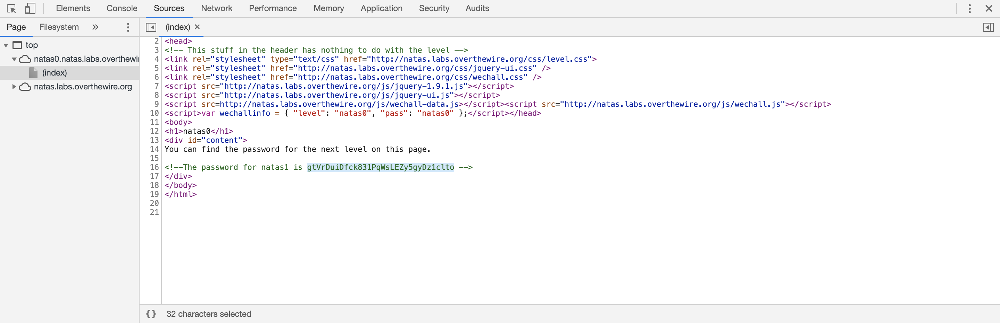
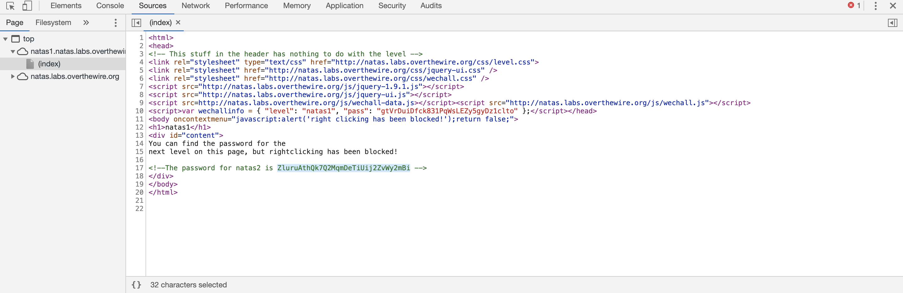
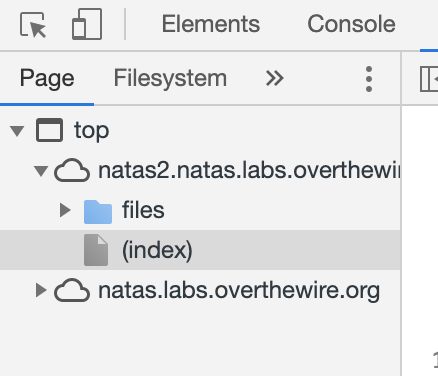
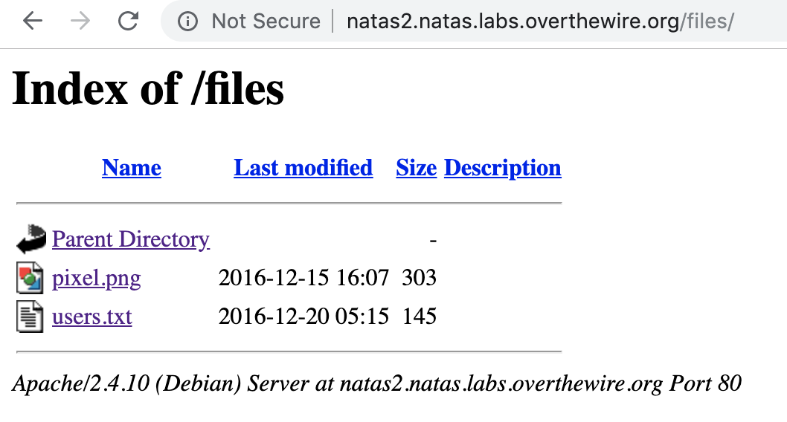
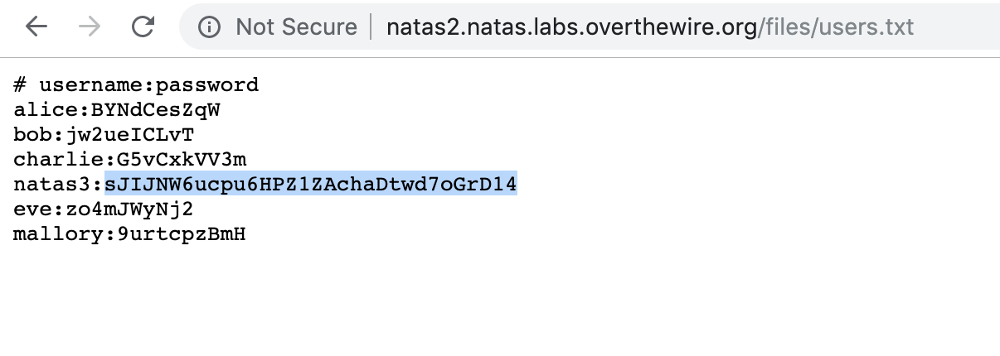
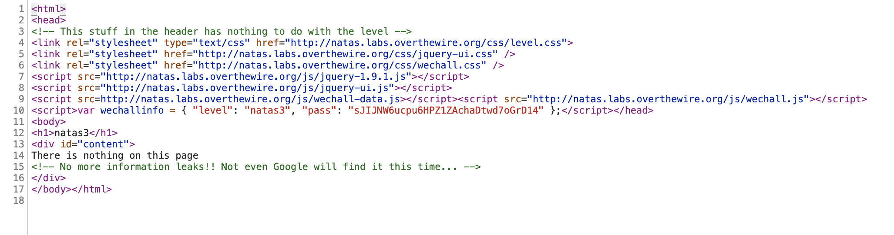
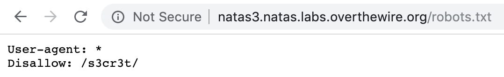
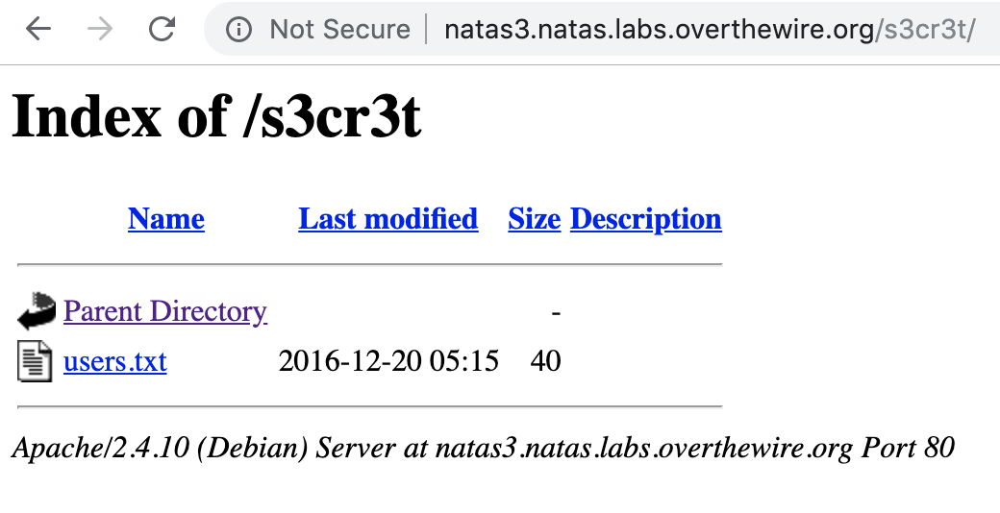
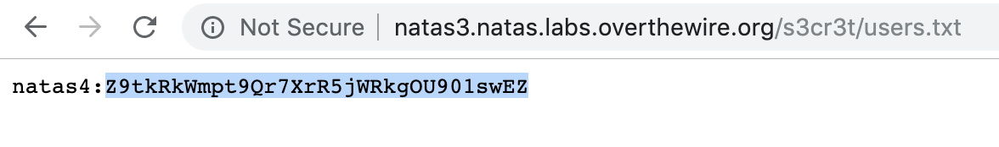

# Natas

user: natas{level} \
website: `http://natas{level}.natas.labs.overthewire.org` \
__All passwords are also stored in /etc/natas_webpass/.__

## level 0
passwd: natas0

## level 1
passwd: gtVrDuiDfck831PqWsLEZy5gyDz1clto

### solution
Use Chrome to check the page source code. \

## level 2
passwd: ZluruAthQk7Q2MqmDeTiUij2ZvWy2mBi

### solution
Same as level 1. \

## level 3
passwd: sJIJNW6ucpu6HPZ1ZAchaDtwd7oGrD14

### solution
Check page source, we find that there is a folder `files`. \

Try to access the folder directly. Something interesting shows up. Click and open `users.txt`. \

The `users.txt` contains the password for natas3. \

## level 4
passwd: Z9tkRkWmpt9Qr7XrR5jWRkgOU901swEZ

### solution
Check the page source. There is a comment saying that "Not even Google will find it this time". Maybe it has something to do with web crawler. \

Check `robots.txt`. \

Check `/s3cr3t`. Bingo! \

The password of natas4: \

