# Natas

user: natas{level} \
website: `http://natas{level}.natas.labs.overthewire.org` \
__All passwords are also stored in /etc/natas_webpass/.__

## level 0
passwd: natas0

## level 1
passwd: gtVrDuiDfck831PqWsLEZy5gyDz1clto

### solution
Use Chrome to check the page source code. \


## level 2
passwd: ZluruAthQk7Q2MqmDeTiUij2ZvWy2mBi

### solution
Same as level 1. \


## level 3
passwd: sJIJNW6ucpu6HPZ1ZAchaDtwd7oGrD14

### solution
Check page source, we find that there is a folder `files`. \


Try to access the folder directly. Something interesting shows up. Click and open `users.txt`. \


The `users.txt` contains the password for natas3. \


## level 4
passwd: Z9tkRkWmpt9Qr7XrR5jWRkgOU901swEZ

### solution
Check the page source. There is a comment saying that "Not even Google will find it this time". Maybe it has something to do with web crawler. \


Check `robots.txt`. \


Check `/s3cr3t`. Bingo! \


The password of natas4: \


## level 5
passwd: iX6IOfmpN7AYOQGPwtn3fXpbaJVJcHfq

### solution
Use [postman](https://www.getpostman.com/). \
Add HTTP header 'Referer'. \


## level 6
passwd: aGoY4q2Dc6MgDq4oL4YtoKtyAg9PeHa1

### solution
Check cookies. \


Change the value of the cookie `loggedin` to 1. \


Request again. \


## level 7
passwd: 7z3hEENjQtflzgnT29q7wAvMNfZdh0i9

### solution
Click 'View sourcecode'. We find that `$secret` should be declared in `includes/secret.inc`. \
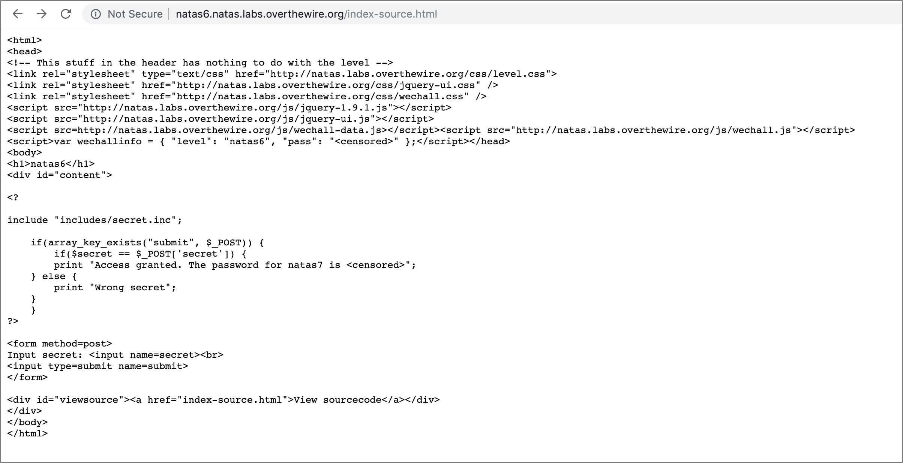

Access `includes/secret.inc`. \


Use postman to make HTTP POST request. \


## level 8
passwd: DBfUBfqQG69KvJvJ1iAbMoIpwSNQ9bWe

### solution
Check page source. We find that there is a `page` parameter for `index.php`. \


Try to pass `page=xx`. From the error message we find that the `index.php` script will try to include file with path given by the `page` parameter. \


We can exploit the `page` parameter and pass relative path to it. By passing `page=../../../../etc/natas_webpass/natas8` we can get the content of the file `/etc/natas_webpass/natas8`. \
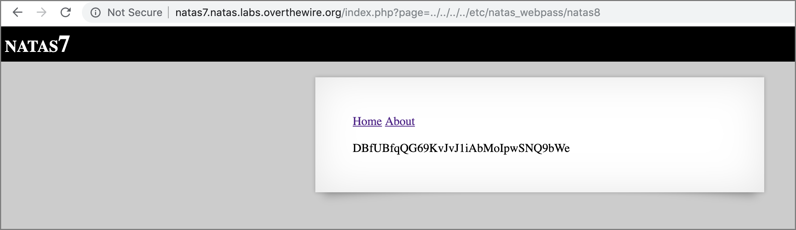

## level 9
passwd: W0mMhUcRRnG8dcghE4qvk3JA9lGt8nDl

### solution
Check page source. We find that `$secret` is encoded to `$encodedSecret`. The encoding function is reversable, so we can write a decoding function to get the value of `$secret`. \


Write a php script and get the value of `$secret`. \
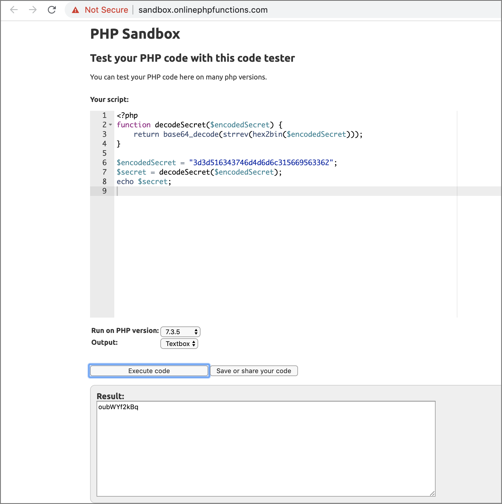

Make an HTTP POST request to get the password of natas9. \
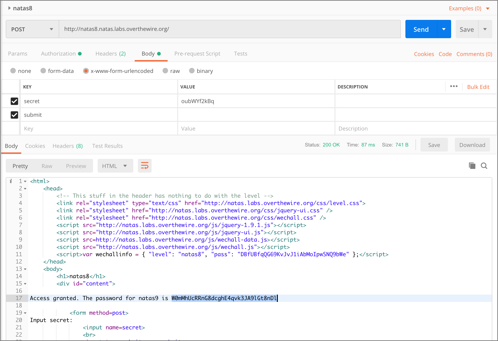

## level 10
passwd: nOpp1igQAkUzaI1GUUjzn1bFVj7xCNzu

### solution
Check page source. We find that the php script will execute system command `grep -i $key dictionary.txt`. We can set the value of `$key` by passing value to the parameter `needle`. Consider a command `grep -i '' /etc/natas_webpass/natas10`, it will return the result we want. To make the command return no error, we can use `||` to prevent the remaining part of the command from being executed. The command we want is `grep -i '' /etc/natas_webpass/natas10 || dictionary.txt`. Thus we should pass `'' /etc/natas_webpass/natas10 ||` to `$key`. \


Make an HTTP GET request to get the password of natas10. \


## level 11
passwd: U82q5TCMMQ9xuFoI3dYX61s7OZD9JKoK

### solution
Check page source. We find that only `;`, `&` and `|` will be detected. \
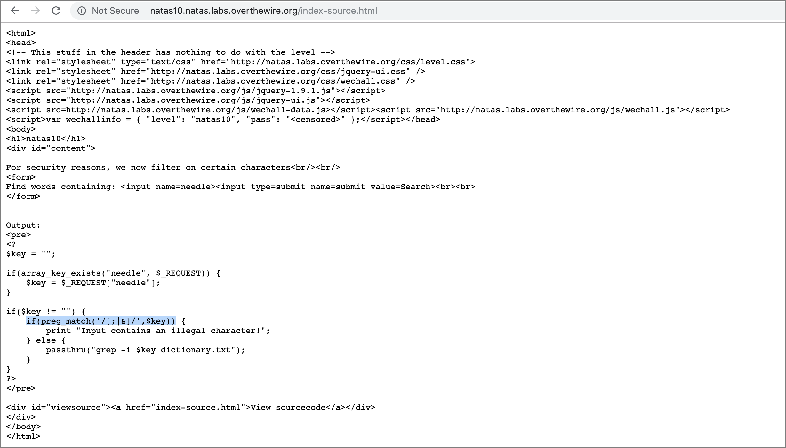

Simply removing the `||` and changing the command to `grep -i '' /etc/natas_webpass/natas11 dictionary.txt` works already. \
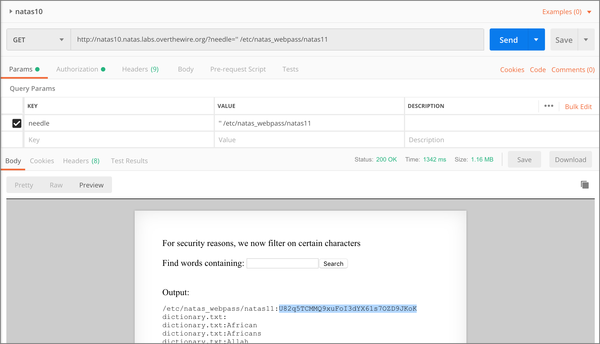

However, for a more elegant output, we can add `--exclude`. The command becomes `grep -i '' /etc/natas_webpass/natas11 --exclude dictionary.txt`. \


## level 12
passwd: EDXp0pS26wLKHZy1rDBPUZk0RKfLGIR3

### solution
Check source code. The associative array with two keys `showpassword` and `bgcolor` is encoded and stored in a cookie `data`. Our target is to figure out the encoding procedure and set the cookie `data` to a value which will be decoded to `array("showpassword"=>"yes", "bgcolor"=>"<whatever>")`. \


Get the value of the cookie corresponding to `array("showpassword"=>"no", "bgcolor"=>"#ffffff")`. \


Let
```
s1 -> json_encode($defaultData)
s2 -> base64_decode($_COOKIE['data'])
```
We have
```
s2 == xor_encrypt(s1)
```
By comparing s1 and s2, we should be able to figure out the `$key` used by the function `xor_encrypt`.

A script to print out s1 and s2: \
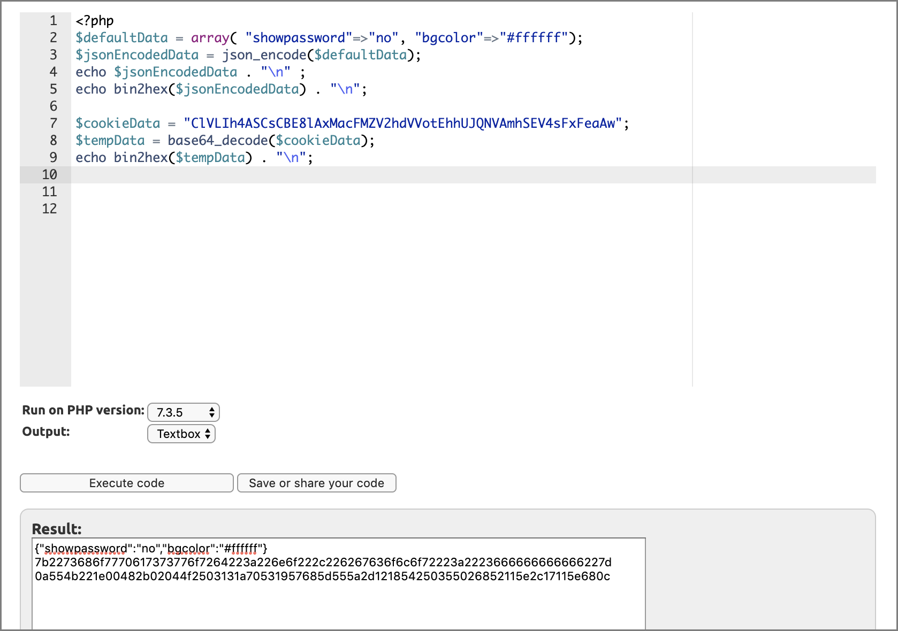

By reformatting the output and focus on one part of it, we can deduce the `$key`. \
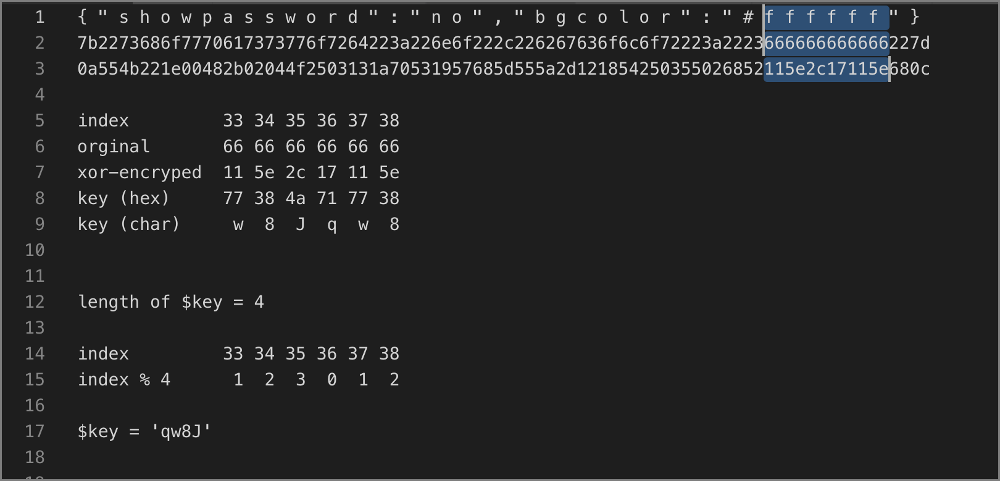

Test the `$key` and use the `$key` to generate the cookie we want. \
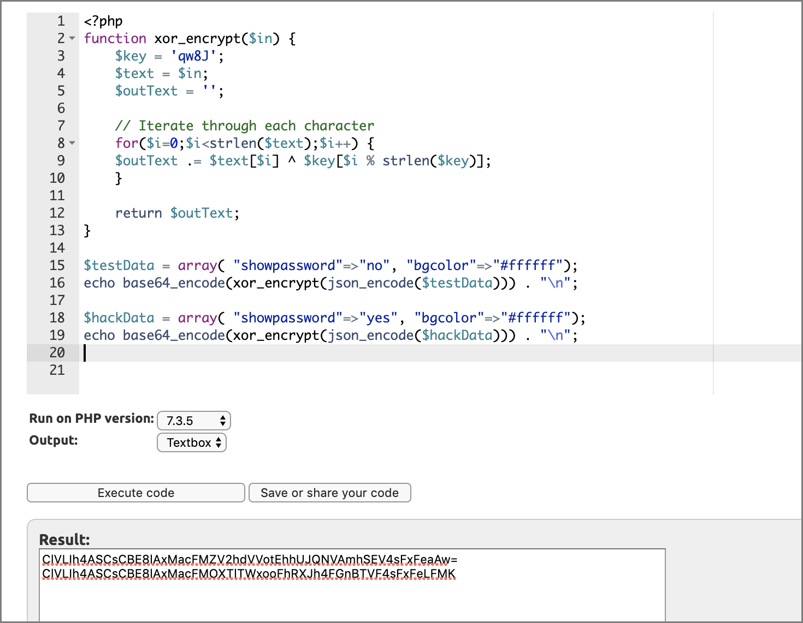

Change the value of the cookie. \


Request again to get the password of natas12. \


## level 13
passwd: jmLTY0qiPZBbaKc9341cqPQZBJv7MQbY

### solution
Check source code. The script will generate a random path `upload/<random_string>.<ext>` and move the uploaded file to that path. The extension `<ext>` is obtained from `$_POST['filename']`. \


Note that if we access a url ending with `.php` then the server will try to look for a php script, interpre it and return the result. Thus if we can (i) upload a php script and (ii) access it with some url ending with `.php` then we can make the server execute (iii) our script. That's all we need to get the password.

(i) can be achived by passing the script to the field `uploadedfile` \
(ii) can be achived by passing a string "whatever.php" to the field `filename` \
(iii) the script for retriving the password:
```php
/* hack.php */
<?php
  echo file_get_contents("/etc/natas_webpass/natas13");
?>
```

Make an HTTP POST request to upload the dark script. \


Access the returned url to get the password of natas13. \
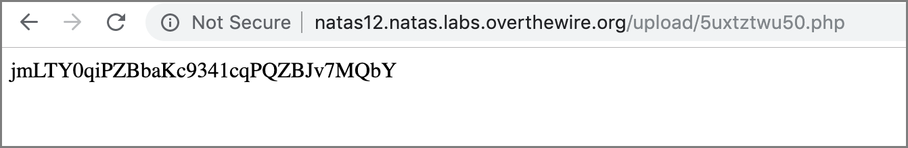

## level 14
passwd: Lg96M10TdfaPyVBkJdjymbllQ5L6qdl1

### solution
Check the source code. The script will now check whether the uploaded file is an image file. The checking is done by the function `exif_imagetype`. \
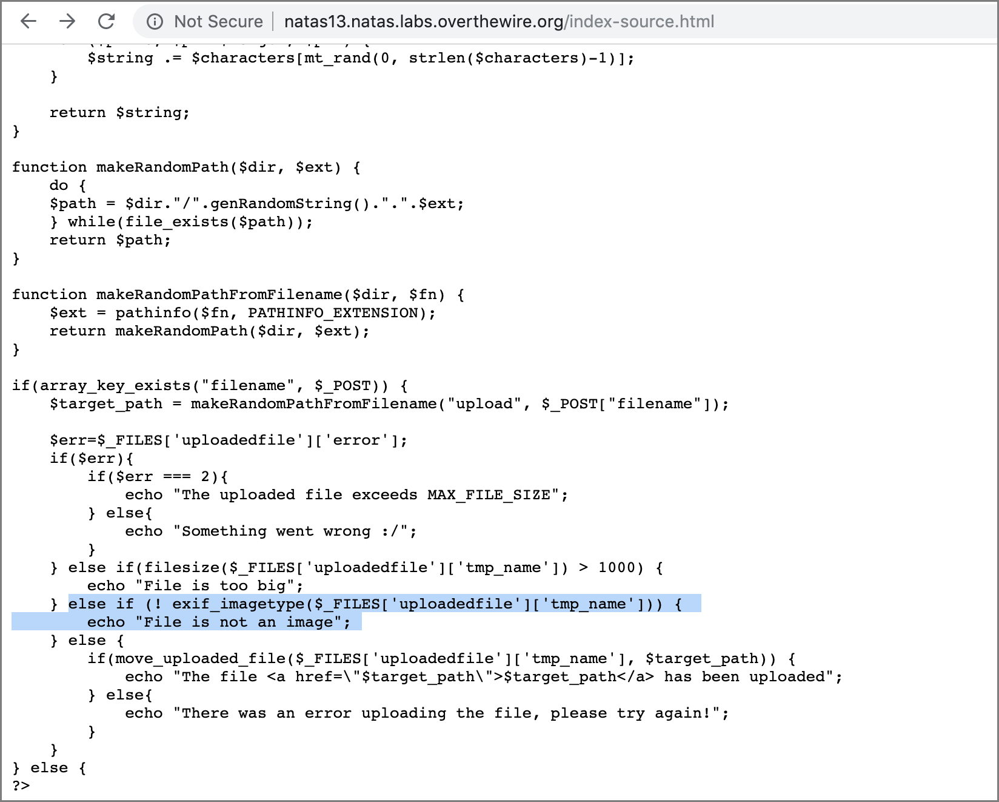

Check the source code of `exif_imagetype` on GitHub. It will call `php_getimagetype`. \


Check the source code of `php_getimagetype`. It will at first read 3 bytes of the file and check whether the file is a `gif` file or a `jpg` file. \
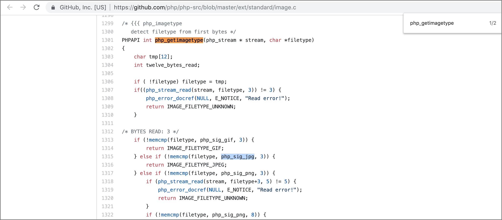

Check the value of `php_sig_jpg`. The value is `ffd8ff` in hex format. \


We only need to add the 3 bytes to the beginnning of our dark script. \
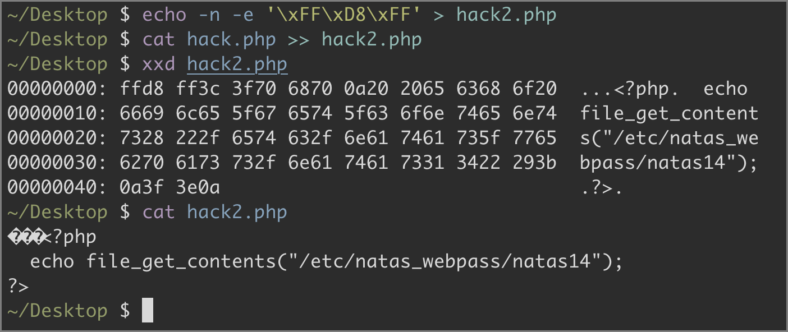

Make an HTTP POST request to upload the dark script. \


Access the returned url to get the password of natas14. \
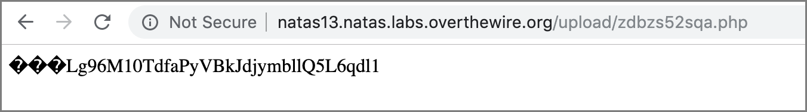
